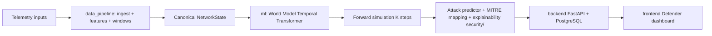

# THREATCAST Architecture (summary)

Full detail with diagrams: [architectures/ARCHITECTURE.md](architectures/ARCHITECTURE.md).
Cross-module interfaces: [CONTRACT.md](CONTRACT.md).

## Problem

Reactive IDS tools classify attacks after the fact. THREATCAST learns network dynamics — `P(S[t+1] | S[t])` over canonical network states — to predict infiltration *before* it completes.

## High-level architecture

```
INPUT ──> INGESTION ──> FEATURE EXTRACTION ──> TIME WINDOW ENGINE
   ──> NETWORK STATE S[t] ──> WORLD MODEL ──> FORWARD SIMULATION S[t+1..K]
   ──> ATTACK PREDICTOR ──> MITRE MAPPING ──> EXPLAINABILITY
   ──> BACKEND API (/api/v1, PostgreSQL) ──> DEFENDER DASHBOARD
```



## Module boundaries

| Path | Owns |
|------|------|
| `data_pipeline/` | PCAP/NetFlow/IPFIX/CSV/auth-log ingestion, flow+packet features, time windows |
| `ml/` | state representation, temporal model, forward simulation, evaluation |
| `backend/` | REST API, PostgreSQL persistence, model-serving facade |
| `frontend/` | defender dashboard UI |
| `security/` | MITRE ATT&CK mapping, explainability |
| `integration/`, `tests/`, `docker/`, `docs/` | cross-cutting |

Modules exchange data only via the canonical schemas in CONTRACT.md.

## Key design decisions

- **World model over classifier**: temporal Transformer learns transitions; risk/malicious probability and stage prediction are heads/predictors on top.
- **Open feature dict**: `NetworkState.features` is extensible; the schema never hard-codes a feature count.
- **Offline-first**: local training/inference only; dataset supplied manually.
- **6 GB VRAM budget**: lightweight Transformer, mixed precision, gradient accumulation, CPU fallback.
- **Contract-first**: schemas, ports, env vars and error format frozen in Phase 1.

See [architectures/ARCHITECTURE.md](architectures/ARCHITECTURE.md) for data flow, database, deployment, streaming-readiness, and security boundaries.
